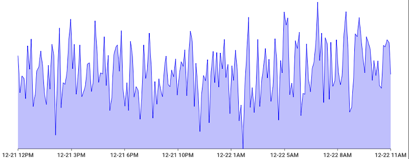

# gotsgen

Golang Time Series Data Generator 


## Documentation

[](http://godoc.org/github.com/intercloud/gotsgen)

Full `go doc` style documentation for the project can be viewed online without
installing this package by using the excellent GoDoc site here:
http://godoc.org/github.com/intercloud/gotsgen

You can also view the documentation locally once the package is installed with
the `godoc` tool by running `godoc -http=":6060"` and pointing your browser to
http://localhost:6060/pkg/github.com/intercloud/gotsgen

## Installation

```bash
$ go get -u github.com/intercloud/gotsgen
```

## Quick Start

Add this import line to the file you're working in:

```Go
import "github.com/intercloud/gotsgen"
```

To generate a tim series, you can use one of the 3 available generators:

* rand: values are random generated, see `math/rand` package (`Float64()`)
* norm: values are generated from a normal distribution, see `math/rand` package (`NormFloat64()`)
* deriv: values are generated from the dicrete derivative of a continuously and randomly increasing counter.

You have to instantiate the package first (let's say you want a one day time series of 200 measurements):

```Go
 duration, _ := time.ParseDuration("24h")
 end := time.Now()
 start := end.Add(-duration)

 gts := gotsgen.Query(start, end, 200, "rand")
```

If you want to test an example program, simply run 

```sh
cd example
go get -v 
go run main.go
```

Then open http://localhost:8080 in your browser.



## License

Gotsgen is licensed under the [Mozilla Public License 2.0](http://mozilla.org/MPL/2.0/).

Don't know which licence is the best for you ? visit https://choosealicense.com/
